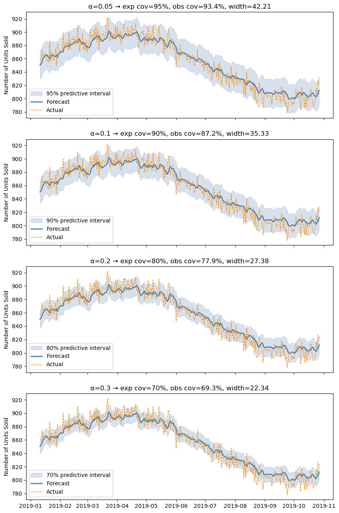

# Dementia Forecasting with LSTM & Conformal Prediction

A Jupyter‐based pipeline to forecast a time‐series (units sold) using a PyTorch LSTM, augmented with split–conformal prediction intervals.  
This project demonstrates how to compute valid predictive intervals under a miscoverage parameter α, and how to adapt conformal methods to non‐exchangeable time‐series data (e.g. dementia progression forecasting).

## Features

- Data loading & preprocessing of `train.csv` and `test.csv`  
- Sequence creation with a sliding _look_back_ window  
- PyTorch LSTM model (multi‐layer, dropout)  
- Inversion of MinMaxScaler to recover true units sold  
- Split‐conformal calibration on a validation set  
- Computation of point forecasts + lower/upper bounds for arbitrary α  
- Visualization of multi‐α intervals in a single column of subplots  

## Repository Structure

```
dementia/
├── data/
│   ├── train.csv
│   └── test.csv
├── lstm_conformal.ipynb    # main notebook
├── requirements.txt        # Python dependencies
└── README.md
```

## Setup

1. Clone via SSH (recommended)  
   ```bash
   git clone git@github.com:UniversityofMissouri/dementia.git
   cd dementia
   ```

2. Create conda (or venv) environment  
   ```bash
   conda create -n dementia python=3.9
   conda activate dementia
   ```

3. Install dependencies  
   ```bash
   pip install -r requirements.txt
   ```

   _requirements.txt_ should include at least:
   ```
   pandas
   numpy
   matplotlib
   statsmodels
   prophet
   arch
   scikit-learn
   torch
   jupyter
   ```

## Usage

1. Launch JupyterLab or Notebook  
   ```bash
   jupyter lab
   ```
2. Open `lstm_conformal.ipynb`  
3. Run cells in order:  
   - Data loading & preprocessing  
   - LSTM model training  
   - Validation calibration & quantile calculation  
   - Test‐set forecasting + interval plotting  

4. In the “Conformal Intervals” section you can adjust:
   ```python
   alphas = [0.05, 0.1, 0.2, 0.3]
   look_back = 10
   forecast_horizon = 200
   ```
Below we generate conformal prediction intervals for miscoverage levels  
α = 0.05, 0.1, 0.2, and 0.3, and report both the empirical coverage and the average interval width. 

As the allowed miscoverage α increases, the intervals become narrower and the observed coverage goes down.
Note that conventional conformal methods assume exchangeability, which is violated in time‐series data—making it an interesting challenge to adapt these techniques for forecasting applications such as dementia.




## Troubleshooting

- **RPC failed; HTTP 400** when doing `git push`  
  - Increase Git HTTP buffer:  
    ```bash
    git config --global http.postBuffer 524288000
    ```
  - Switch to SSH remote:  
    ```bash
    git remote set-url origin git@github.com:UniversityofMissouri/dementia.git
    ```
  - Remove large binaries or checkpoints from Git, add to `.gitignore`.

- **CUDA unavailable**: falls back to CPU automatically via  
  ```python
  device = torch.device("cuda" if torch.cuda.is_available() else "cpu")
  ```


